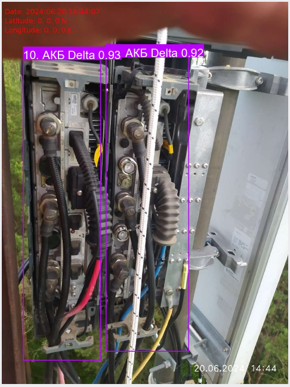
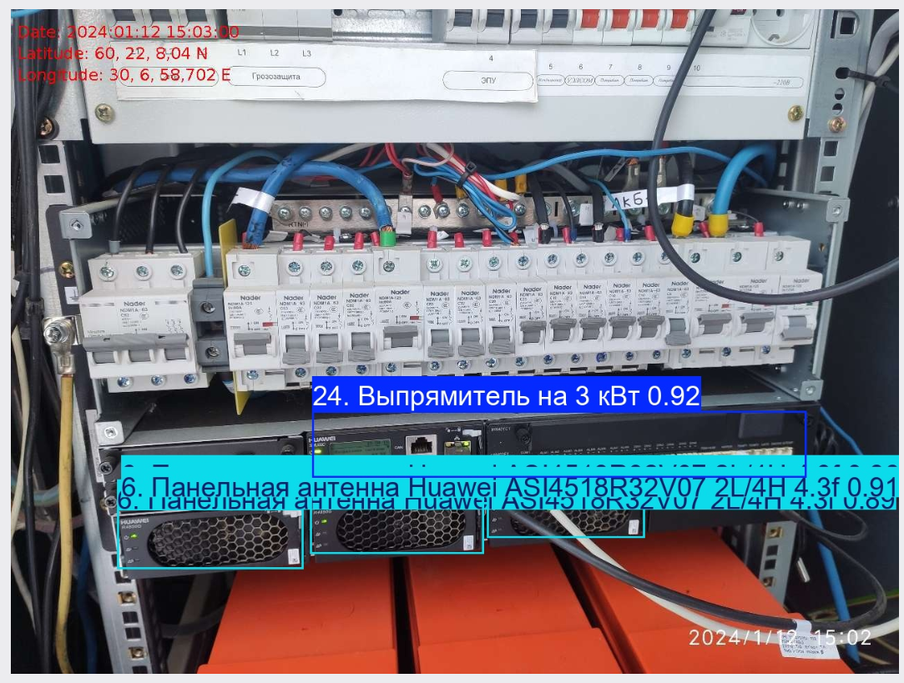
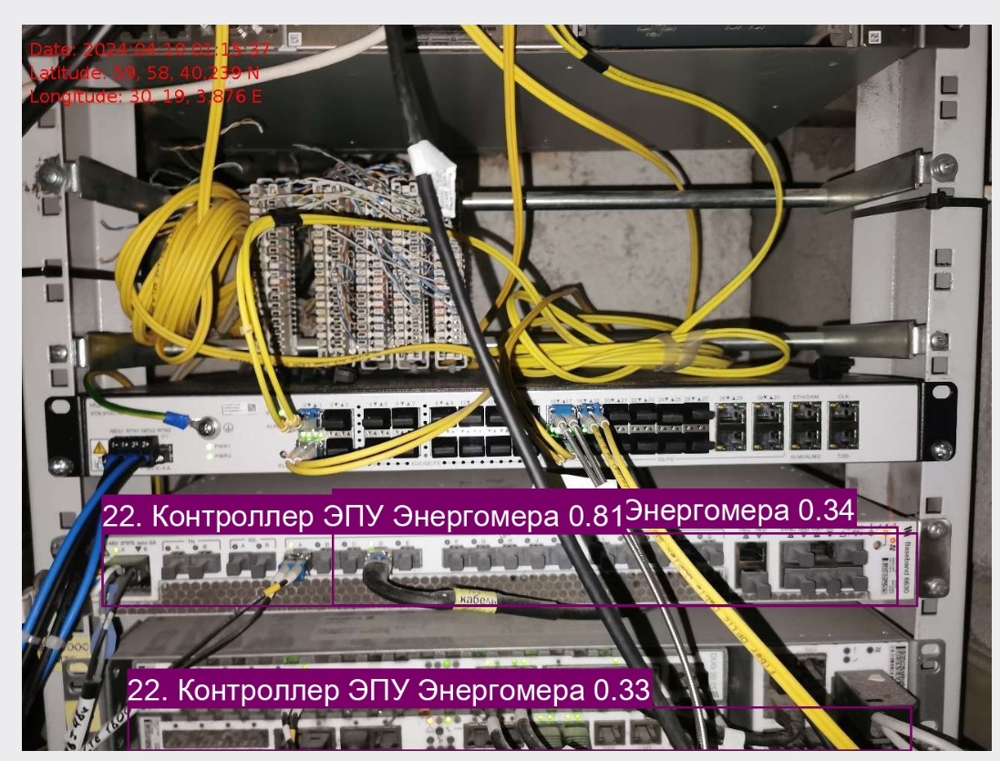
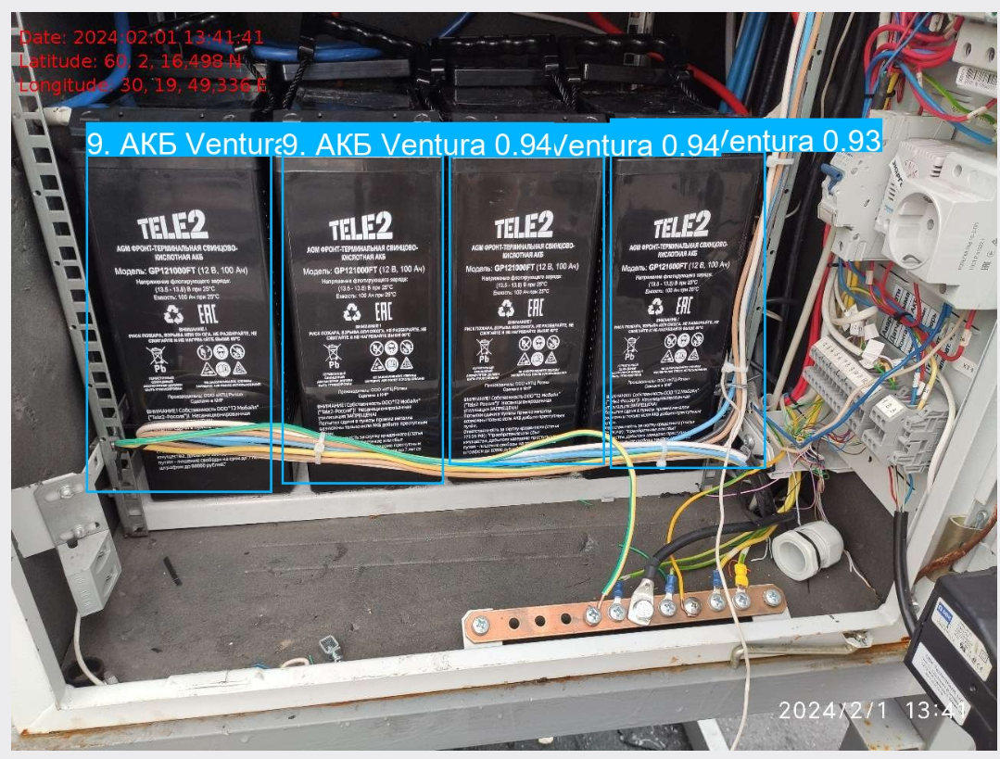
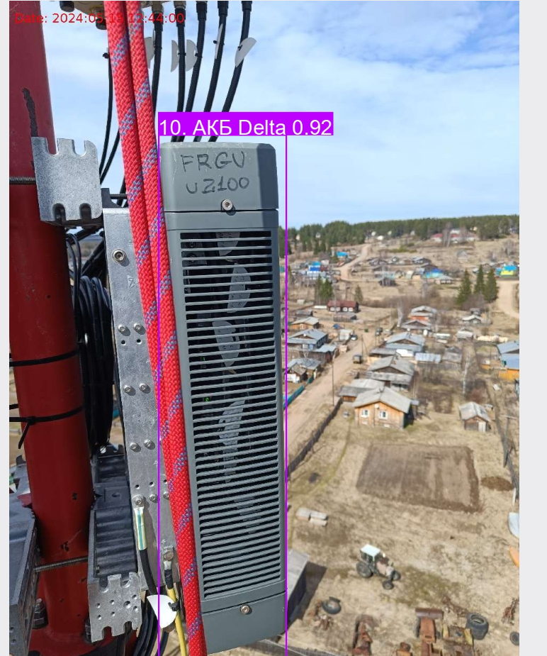
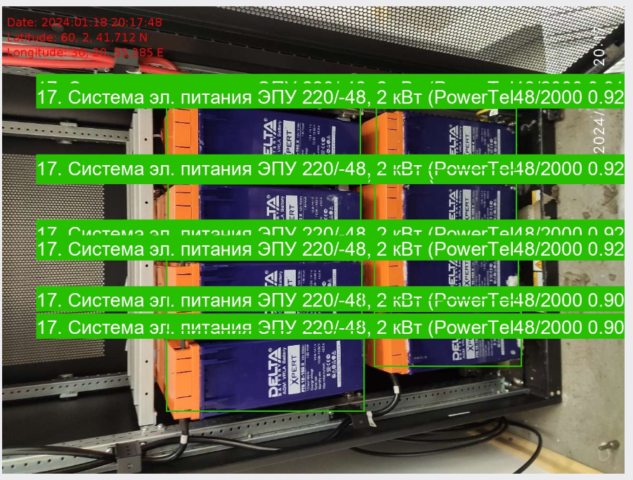

# CV. Детекция оборудования

С помощью предоставленных данных в виде двух папок Annotations - где лежали аннотации в формате XML к картинкам оборудования из второй папки - images. Из-за того, что разметку данных прислали не в том виде, так как было запланировано обучение моели YOLO, то формат должен был быть не XML, а YAML, поэтому пришлось писать код, который будет преобразовывать файлы в формат YAML. Затем последовал анализ данных, его предобработка и само дообучение модели YOLO11x на 100 эпохах. Осуществлялось это на сервере при помощи видеокарты A100.

Итоги работы модели на тестовой выборке после обработки изображений:

1. 

2. 

3. 

4. 

5. 

6. 

